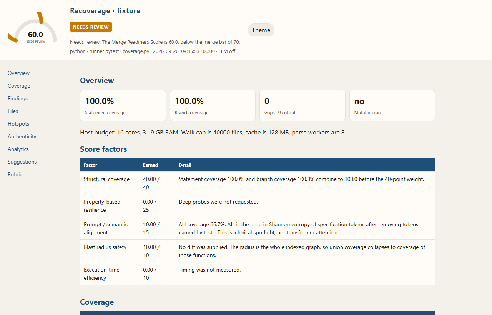

# Recoverage

[](https://pypi.org/project/coderecoverage/)
[](https://pypi.org/project/coderecoverage/)
[](https://github.com/LITDataScience/recoverage/actions/workflows/ci.yml)

Recoverage scores whether a test suite is ready to merge, then shows the gaps on the functions that matter.

```bash
python3 -m pip install coderecoverage
recoverage run .
```

Trusted trees only. Default `run` does not execute project code. `--dynamic` and `--deep` run that checkout as you, with no OS sandbox. Read [docs/security.md](docs/security.md) before you point it at a repository.

No GPU is required or used. NVIDIA, AMD, and Mac GPUs do not change the run. The work is CPython on the CPU.

The PyPI project is `coderecoverage`. The command and the import are `recoverage`. `0.1.0` is the release on PyPI. This checkout is `0.2.0`.

<p align="center">
  
</p>

Open the same page locally with `recoverage show examples/sample-report`. The published guide is `recoverage docs`.

## Install

Python 3.11+. SVG charts are in the normal install. PNG charts and the Tree-sitter call graph are `python3 -m pip install "coderecoverage[report]"`. From this checkout, `python3 -m pip install -e ".[dev]"`.

PDF compilation needs the [Typst](https://github.com/typst/typst) CLI on `PATH`. Without it, Markdown and HTML still write and the command continues.

## Try the fixture

`examples/fixture` is a small shop package. The checked-in sample is a `--dynamic` run: **MRS 60.0**, gate `needs-review`, statement coverage **100%**. The score stays under the merge bar because property, mutation, and timing probes were not requested.

```bash
python3 -m recoverage run examples/fixture --output examples/sample-report --dynamic --no-llm
python3 -m recoverage show examples/sample-report --no-open
```

Omit `--dynamic` and coverage is `not measured`, not `0%`.

<details>
<summary>Commands</summary>

```bash
recoverage run [path] [--output DIR] [--dynamic] [--deep] [--threshold GATE|SCORE] [--llm | --no-llm]
recoverage report [path] [--output DIR] [--input analysis.json] [--dynamic] [--deep] [--threshold GATE|SCORE] [--llm | --no-llm]
recoverage generate [path] [--output DIR] [--dry-run] [--dynamic] [--deep] [--llm | --no-llm]
recoverage show [path] [--output DIR] [--port N] [--no-open]
recoverage docs [--offline]
```

Exit code is `1` when `--threshold` is missed, `2` on usage or setup errors, `0` otherwise. `--deep` implies `--dynamic` and also runs property, mutation, timing, and search probes out of process. `--llm` is what sends gap metadata to an OpenAI-compatible API. A machine under 2 GB of RAM does not start those probes. A temp volume under 1 GB free does not start a temp copy. Details are in [docs/cli.md](docs/cli.md).

</details>

<details>
<summary>Gates</summary>

| Gate | You can merge when |
| --- | --- |
| blocked | No. Missing runner, coverage under 20%, score under 40, or the tests did not exit 0. |
| needs-review | Not yet. A runner exists and the score is at least 40, but the merge bar is open. |
| merge-ready | Score at least 70, statement coverage at least 60%, coverage was measured, no critical gap. |
| production-ready | Score at least 85, with the same coverage and gap rules. |

The full rubric, including how each factor is measured, is below. `--threshold` takes a gate name or a number.

</details>

## Docs

- [Getting started](docs/getting-started.md)
- [CLI](docs/cli.md)
- [Pipeline](docs/pipeline.md)
- [Scoring](docs/scoring.md)
- [Reports](docs/reports.md)
- [Report anatomy](docs/report-anatomy.md)
- [Test generation](docs/test-generation.md)
- [Security](docs/security.md)
- [Publishing](docs/pypi.md)
- [CI](docs/ci.md)
- [Roadmap](docs/ROADMAP.md)
- [Changelog](docs/CHANGELOG.md)

## Recoverage score rubric

The score is the Merge Readiness Score (MRS), 0–100. It is the PRD's weighted sum, not a line-coverage percentage.

| Factor | Points | How it is measured |
| --- | --- | --- |
| Structural coverage | 40 | 60% project statement coverage + 40% branch coverage. Unmeasured runtime coverage scores 0. coverage.py's own `percent_covered` is reported beside it and is not the score: with `--branch` that headline blends arcs into statements. |
| Property-based resilience | 25 | Share of property trials that held. The properties are structural conformance, determinism, and entity substitution. The engine runs at least 1,000 inputs when pure functions exist. Failing inputs are shrunk. This is not a frozen expected-output check. |
| Prompt / semantic alignment | 15 | ΔH, the drop in Shannon entropy of specification tokens once tokens named by tests are removed. Offline this is a lexical spotlight, not transformer attention. No spec text scores 0. |
| Blast radius safety | 10 | Union coverage of the call-graph radius. With no diff, the radius is the whole indexed graph and the report says so. |
| Execution-time efficiency | 10 | Mann-Whitney U between baseline inputs and heavier inputs on this revision. Points are lost only when p < 0.05 and the median is more than 8× slower. This is not a cross-commit benchmark. |

Mutation testing is a separate measurement. When it runs, mutants are applied on a temp copy and the kill count is printed. It is not silently folded into MRS. If it does not run, the report says it did not run.

Flake markers found by a static scan subtract 2 points, floored at 0. That scan is not a reproduction. Drafts that `recoverage generate` keeps are executed 5 times in a temp copy before they are copied back.

### Gates

MRS is mapped onto four gates so a CI job can fail below a named bar. The PRD badge uses the same threshold, default 85.

| Gate | Rule |
| --- | --- |
| blocked | No test runner, or measured project statement coverage is below 20%, or MRS is below 40, or the test run did not exit 0. Badge: NOT MERGEABLE. |
| needs-review | A runner exists and MRS is at least 40, but the merge bar is not met. Unmeasured runtime coverage cannot be graded above this gate. |
| merge-ready | MRS ≥ 70, statement coverage ≥ 60%, runtime coverage was measured, and there is no critical gap. Badge: MERGEABLE. |
| production-ready | MRS ≥ 85 (the PRD threshold), statement coverage ≥ 60%, runtime coverage was measured, and there is no critical gap. Badge: PRODUCTION READY. |

`--threshold` accepts a gate name or a number. A gate threshold passes only when the result gate ranks at least that high: blocked < needs-review < merge-ready < production-ready. A numeric threshold passes when MRS is greater than or equal to the number.

### Separate from MRS

CRAP, assertion strength, dependency authenticity, static flakiness risk, and the mutation score are reported on an authenticity scorecard. They are not added into the 100 points and they do not move the gate. A generated draft is kept when it adds covered lines or kills a mutant the existing suite left alive. That filter is there because a coverage bump with a vacuous assertion is not evidence. Drafts still do not lock in an observed return value.
