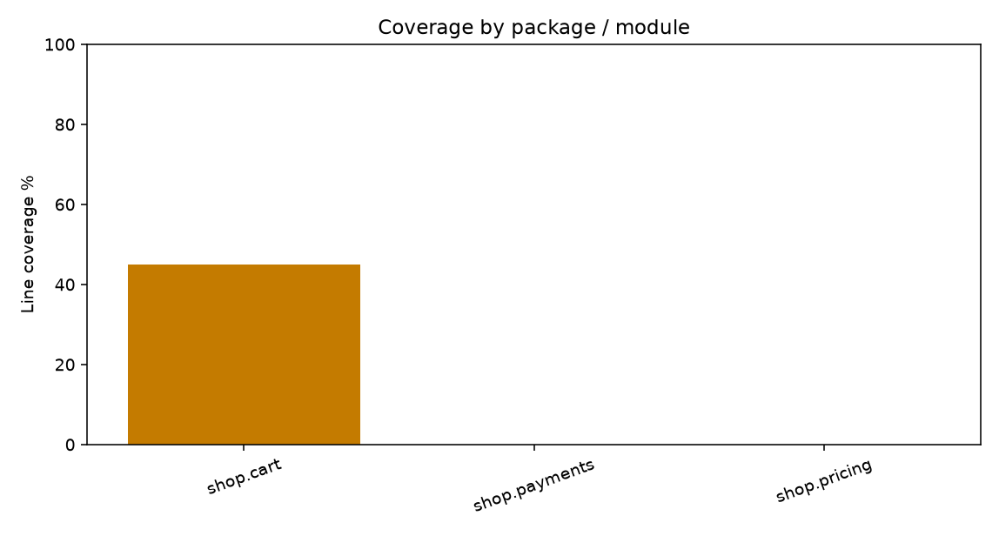
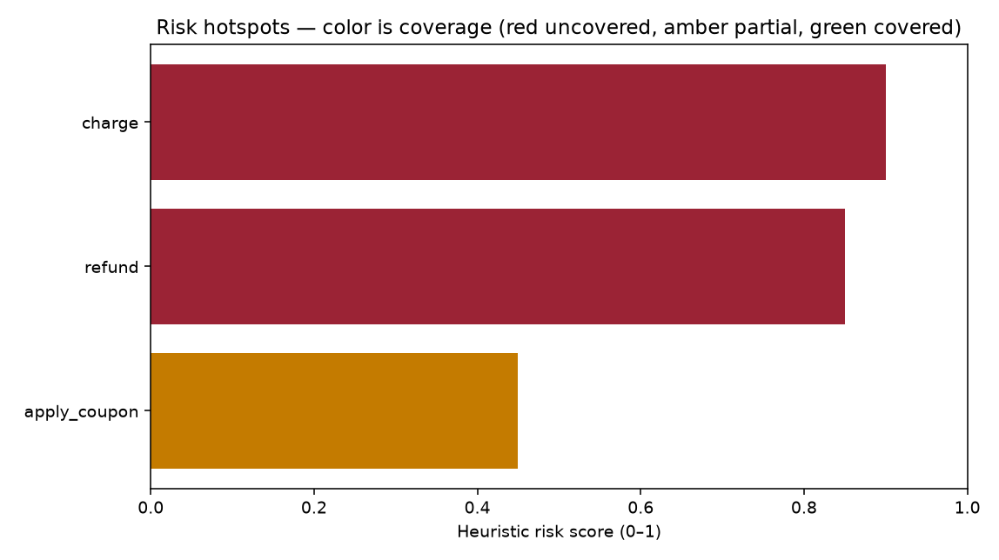
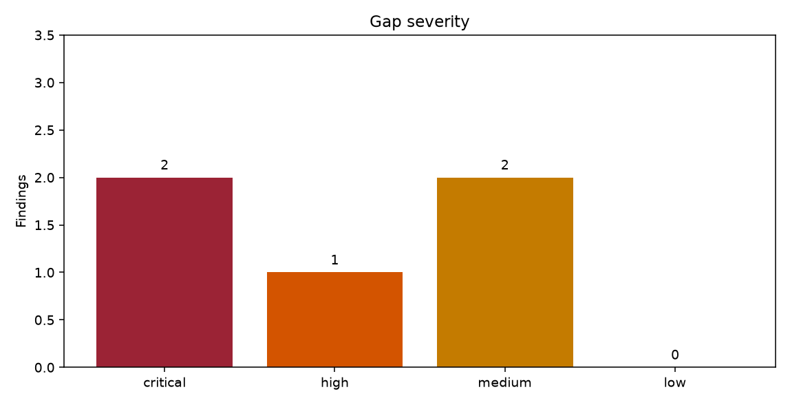

# Recoverage report

**Merge Readiness Score: 32.5 / 100**  
**Gate: `blocked`**  
**Badge: `NOT MERGEABLE`**

Not mergeable. Measured statement coverage is 16.7%, under 20%, and the Merge Readiness Score is 32.5, under 40.

Project: `/agent/recoverage/examples/fixture`  
Language: python  
Test runner: pytest  
Coverage tool: coverage.py  
LLM: off  
Generated: 2026-09-23T15:33:19+00:00

<!-- recoverage:score=32.5;gate=blocked;mutation=true -->

## Coverage stats

| Metric | Value |
| --- | --- |
| Project statement coverage | 16.7% |
| Tool percent_covered | 14.1% |
| Branch coverage | 10.5% |
| Branch figure is runtime-tool-only | yes |
| Tool | coverage.py |
| Measured | yes |
| Test exit code | 0 |

## Score factors

| Factor | Earned | Max | Heuristic | Detail |
| --- | --- | --- | --- | --- |
| Structural coverage | 5.69 | 40 | no | Statement coverage 16.7% and branch coverage 10.5% combine to 14.2 before the 40-point weight. Tool percent_covered is 14.1% and is not used: branch mode blends arcs into that headline. |
| Property-based resilience | 25.00 | 25 | no | Ran 1000 property trials across structural conformance, determinism, and entity substitution. Failing inputs were shrunk toward simpler values. |
| Prompt / semantic alignment | 0.26 | 15 | yes | ΔH coverage 1.7%. ΔH is the drop in Shannon entropy of specification tokens after removing tokens named by tests. This is a lexical spotlight, not transformer attention. |
| Blast radius safety | 1.57 | 10 | yes | No diff was supplied. The radius is the whole indexed graph, so union coverage collapses to coverage of those functions. |
| Execution-time efficiency | 0.00 | 10 | no | Mann-Whitney U compared baseline inputs with heavier inputs on this same revision. A regression is recorded only when p < 0.05 and the median is more than 8x slower. This is not a cross-commit EffiBench run. Heavier inputs were slower for subtotal (10.99x). |

Killed 1/5 viable mutants on a temp copy (0 timeouts counted as killed, 0 unviable excluded). MSI 20.0. MSI_total 20.0 keeps unviable mutants in the denominator. This is a sampled operator flip, not a mutmut or cosmic-ray campaign. Project files were not edited.

## Authenticity scorecard

Authenticity scorecard is not the Merge Readiness Score and does not move the gate. DAR checks the workspace, the stdlib, and declared manifests. It does not query a package registry. FIRI is a static scan, not a reproduction of a flake.

| Dimension | Value | Threshold | Status |
| --- | --- | --- | --- |
| Dependency authenticity (DAR) | 100.0 | 100% | PASS |
| Statement coverage | 16.7 | ≥ 80% | FAIL |
| Branch coverage | 10.5 | ≥ 75% | FAIL |
| Mutation score (MSI) | 20.0 | ≥ 70% | FAIL |
| Assertion strength (ASR) | 100.0 | ≥ 85% | PASS |
| Mean CRAP | 34.2 | ≤ 15 | FAIL |
| CRAP > 30 | 3 | 0 | FAIL |
| Flakiness risk (FIRI) | 0.0 | 0% | PASS |

CRAP = complexity² × (1 − coverage)³ + complexity. Above 30 the function is a refactor-or-test target. Unmeasured coverage is treated as 0.

| Function | Complexity | Coverage | CRAP |
| --- | --- | --- | --- |
| `charge` | 7 | 0% | 56.0 |
| `tier_price` | 7 | 0% | 56.0 |
| `apply_coupon` | 7 | 10% | 42.7 |
| `refund` | 3 | 0% | 12.0 |
| `subtotal` | 4 | 78% | 4.2 |

ASR is substantive assertions divided by all assertions. Tautologies (x == x, assert True) and type-or-presence checks are not substantive. A comparison against a literal is substantive and can still be a magic-number smell.

Vacuous or tautological assertions: 0. Assertion roulette: 0. Magic-number asserts: 1. AAA interleaving: 0.

DAR = verified imports / imports. Verified means stdlib, a module in this workspace, or a name declared in a manifest. No registry was contacted.

Phantom imports: none.

FIRI = tests with direct time, random, filesystem, or network calls, divided by test functions. This does not re-run the suite.

## Property-based testing

Ran 1000 property trials across structural conformance, determinism, and entity substitution. Failing inputs were shrunk toward simpler values.

| Symbol | Trials | Passed | Failed |
| --- | --- | --- | --- |
| `subtotal` | 250 | 250 | 0 |
| `apply_coupon` | 250 | 250 | 0 |
| `charge` | 250 | 250 | 0 |
| `refund` | 250 | 250 | 0 |

## Prompt coverage

ΔH is the drop in Shannon entropy of specification tokens after removing tokens named by tests. This is a lexical spotlight, not transformer attention.

## Blast radius

No diff was supplied. The radius is the whole indexed graph, so union coverage collapses to coverage of those functions.

Union coverage: 15.7%.

## Execution time

Mann-Whitney U compared baseline inputs with heavier inputs on this same revision. A regression is recorded only when p < 0.05 and the median is more than 8x slower. This is not a cross-commit EffiBench run. Heavier inputs were slower for subtotal (10.99x).

## Code graph

Tree-sitter index: yes. Entities: 5. Communities: 5.

## Coverage by package

## Risk hotspots

| Function | File | Risk | Coverage | Tags |
| --- | --- | --- | --- | --- |
| `charge` | `src/shop/payments.py` | 0.90 | 0% | payment |
| `refund` | `src/shop/payments.py` | 0.85 | 0% | payment |
| `apply_coupon` | `src/shop/cart.py` | 0.45 | 10% | payment |

## Gap severity

## Findings

### G01 · critical · charge never ran

`src/shop/payments.py` `charge`. Kind: `untested-function`.

src/shop/payments.py:6 has 11 executable lines in range and none executed. Risk 0.90 (payment). A regression in this function would ship unnoticed.

Suggestion: Add a pytest test that calls charge(amount, method, authorized) and asserts each branch (6 static decision points).

### G02 · critical · refund never ran

`src/shop/payments.py` `refund`. Kind: `untested-function`.

src/shop/payments.py:19 has 6 executable lines in range and none executed. Risk 0.85 (payment). A regression in this function would ship unnoticed.

Suggestion: Add a pytest test that calls refund(amount, captured) and asserts each branch (2 static decision points).

### G03 · high · tier_price never ran

`src/shop/pricing.py` `tier_price`. Kind: `untested-function`.

src/shop/pricing.py:6 has 15 executable lines in range and none executed. Risk 0.00 (no special risk tags). A regression in this function would ship unnoticed.

Suggestion: Add a pytest test that calls tier_price(units, tier) and asserts each branch (6 static decision points).

### G04 · medium · apply_coupon is only partly covered

`src/shop/cart.py` `apply_coupon`. Kind: `partial-branch`.

src/shop/cart.py:17 executed 1/10 statement lines (10%). Missing lines: 18, 19, 20, 21, 22, 23, 24, 25, 26. Risk 0.45 (payment).

Suggestion: Extend the pytest tests so the uncovered branches in apply_coupon actually run.

### G05 · medium · subtotal is only partly covered

`src/shop/cart.py` `subtotal`. Kind: `partial-branch`.

src/shop/cart.py:6 executed 7/9 statement lines (78%). Missing lines: 8, 12. Risk 0.00 (no special risk tags).

Suggestion: Extend the pytest tests so the uncovered branches in subtotal actually run.

## Suggestions

Read the findings from the top. Critical and high items are the ones that move the gate.

- `recoverage generate` keeps a draft only after a sandbox compile and 5 passing runs, and only if it adds covered lines or kills a mutant the current suite left alive. It does not lock in observed return values.
- Recoverage will not delete or overwrite an existing test file.
- Prompt coverage ΔH is a lexical entropy proxy unless an attention model is actually queried. The report names which one ran.
- Mutation counts come from temp-copy mutants. If that section says mutation did not run, it did not.
- `charge` CRAP 56.0 with complexity 7. Above 30, add tests or split the function.

Concrete tests to write:

- `charge` (critical): Add a pytest test that calls charge(amount, method, authorized) and asserts each branch (6 static decision points).
- `refund` (critical): Add a pytest test that calls refund(amount, captured) and asserts each branch (2 static decision points).
- `tier_price` (high): Add a pytest test that calls tier_price(units, tier) and asserts each branch (6 static decision points).
- `apply_coupon` (medium): Extend the pytest tests so the uncovered branches in apply_coupon actually run.
- `subtotal` (medium): Extend the pytest tests so the uncovered branches in subtotal actually run.

Re-run after editing tests: `recoverage run . --no-llm --threshold merge-ready`

## Recoverage score rubric

The score is the Merge Readiness Score (MRS), 0–100. It is the PRD's weighted sum, not a line-coverage percentage.

| Factor | Points | How it is measured |
| --- | --- | --- |
| Structural coverage | 40 | 60% project statement coverage + 40% branch coverage. Unmeasured runtime coverage scores 0. coverage.py's own `percent_covered` is reported beside it and is not the score: with `--branch` that headline blends arcs into statements. |
| Property-based resilience | 25 | Share of in-process property trials that held. The properties are structural conformance, determinism, and entity substitution. The engine runs at least 1,000 inputs when pure functions exist. Failing inputs are shrunk. This is not a frozen expected-output check. |
| Prompt / semantic alignment | 15 | ΔH, the drop in Shannon entropy of specification tokens once tokens named by tests are removed. Offline this is a lexical spotlight, not transformer attention. No spec text scores 0. |
| Blast radius safety | 10 | Union coverage of the call-graph radius. With no diff, the radius is the whole indexed graph and the report says so. |
| Execution-time efficiency | 10 | Mann-Whitney U between baseline inputs and heavier inputs on this revision. Points are lost only when p < 0.05 and the median is more than 8× slower. This is not a cross-commit benchmark. |

Mutation testing is a separate measurement. When it runs, mutants are applied on a temp copy and the kill count is printed. It is not silently folded into MRS. If it does not run, the report says it did not run.

Flake markers found by a static scan subtract 2 points, floored at 0. That scan is not a reproduction. Drafts that `recoverage generate` keeps are executed 5 times in a sandbox before they are copied back.

### Gates

MRS is mapped onto four gates so a CI job can fail below a named bar. The PRD badge uses the same threshold, default 85.

| Gate | Rule |
| --- | --- |
| blocked | No test runner, or measured project statement coverage is below 20%, or MRS is below 40. Badge: NOT MERGEABLE. |
| needs-review | A runner exists and MRS is at least 40, but the merge bar is not met. Unmeasured runtime coverage cannot be graded above this gate. |
| merge-ready | MRS ≥ 70, statement coverage ≥ 60%, runtime coverage was measured, and there is no critical gap. Badge: MERGEABLE. |
| production-ready | MRS ≥ 85 (the PRD threshold), statement coverage ≥ 60%, runtime coverage was measured, and there is no critical gap. Badge: PRODUCTION READY. |

`--threshold` accepts a gate name or a number. A gate threshold passes only when the result gate ranks at least that high: blocked < needs-review < merge-ready < production-ready. A numeric threshold passes when MRS is greater than or equal to the number.

### Separate from MRS

CRAP, assertion strength, dependency authenticity, static flakiness risk, and the mutation score are reported on an authenticity scorecard. They are not added into the 100 points and they do not move the gate. A generated draft is kept when it adds covered lines or kills a mutant the existing suite left alive. That filter is there because a coverage bump with a vacuous assertion is not evidence. Drafts still do not lock in an observed return value.
